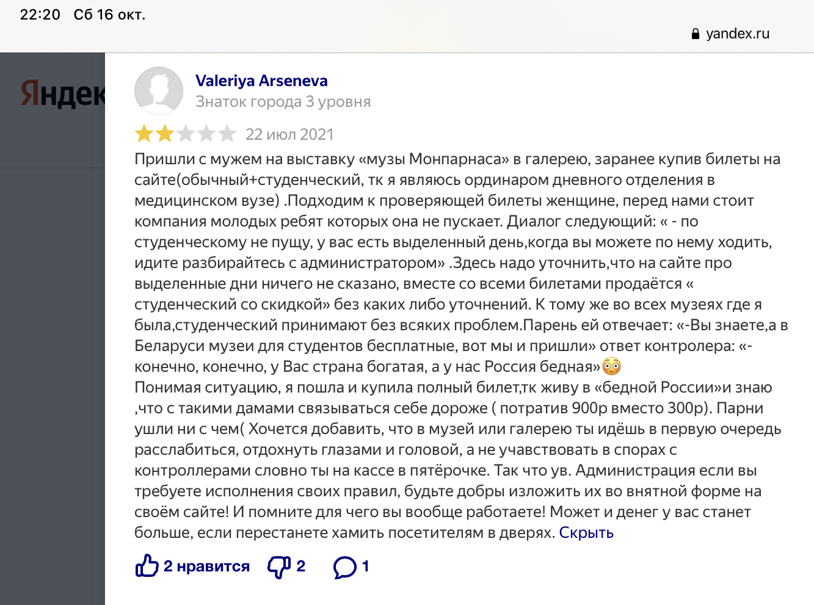
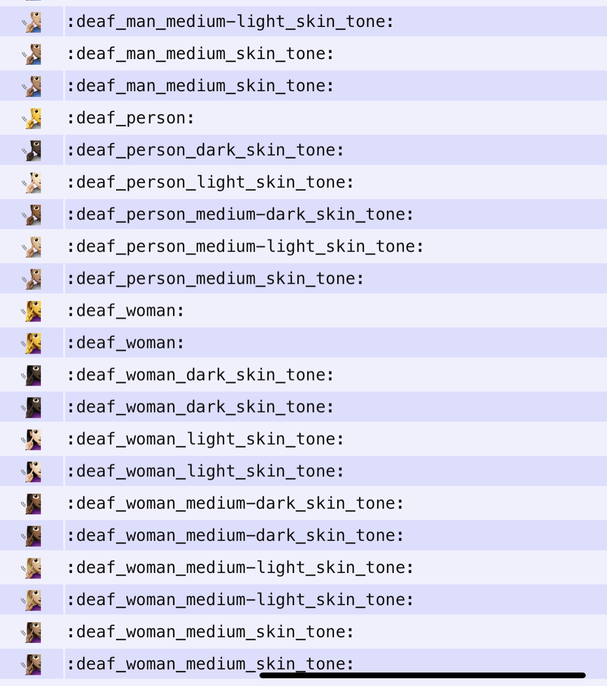

# Как распознать эмоции


 ## Анализ эмоций в тексте

В художественном или любом традиционном тексте мы считываем эмоции из слов и знаков препинанй @#$%^  
Это можно проанализировать, задав условия по поиску определенных слов или "!!!" при помощи :snake:

Но смысл текста с использованием эмодзи при помощи программы считать нельзя. Сравните

Отличное место

*или*

Отличное место :smirk:

## В каких областях эмодзи важнее всего?

+ Социальные сети

+ Отзывы

#### То есть если вам важно мнение аудитории, то придется читать эмодзи

## А в культурологии?

Все слышали, что я люблю музеи и хочу делать их лучше. Это невозможно без обратной связи. Часто эмодзи выполняют функцию эмоционального громоотвода в тексте, и их используют для подчеркивания основной мысли. Пожалуй, будет нелишним узнать, что именно в отзыве вызвало самую сильную эмоцию.

Если речь о том, чтобы привлекать школьную и студенческую аудиторию, то эмоджи могут стать фокусом опроса мнения, особенно не в городах-миллионниках.

Конечно, бывает так


Но чаще уже так (про Гараж)


или так (про Пушкинский музей)



Короче, в любой обратной связи появляются эмодзи. Как картинки они бывают сложными для быстрого считывания





## Чем поможет библиотека Emoji?

При загрузке и обработке текста с эмодзи можно расшифровать их таким образом:

```
emoji.demojize("🤯")
:exploding_head:
```

То есть, вместо трудно различимой закорючки у вас в комментарии указан примерный смысл, который хотел вложить автор.

Почему примерный? Потому что иногда автор ничего не хочет сказать читателю.


_____________________________________________________________________________________________________________________

В коде показан пример, как можно "расшифровать" эмодзи, выделив его из текста

ссылка на код: [тут](https://colab.research.google.com/drive/19mAihYg-RKP2FH-9zOjMhSoIg6xjO3eq?authuser=1#scrollTo=XWso82XQ_DvM)


